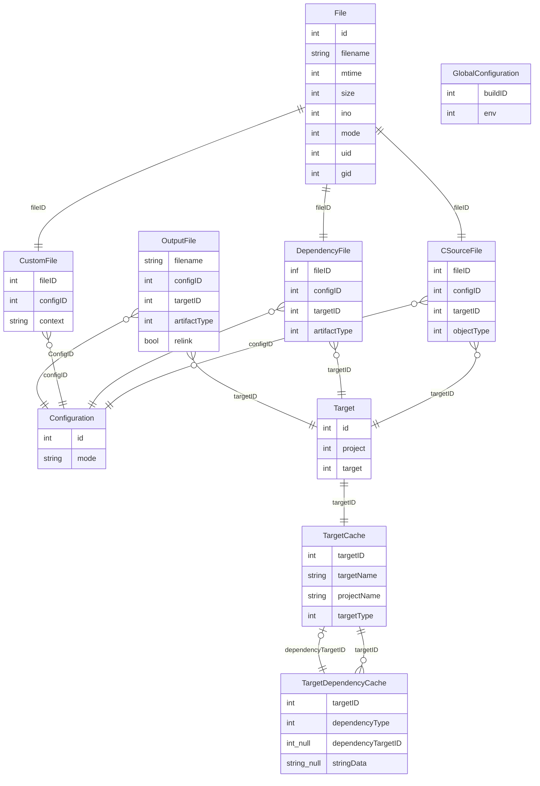

```mermaid
erDiagram

File {
	int id
	string filename
	int mtime
	int size
	int ino
	int mode
	int uid
	int gid
}

CSourceFile {
	int fileID
	int configID
	int targetID
	int objectType
}

Configuration {
  int id
	string mode
}

Target {
	int id
	int project
	int target
}

GlobalConfiguration {
	%% The Beaver buildId; regenerated on every build
  int buildID
  %% A hash computed from the environment variables
  int env
}

DependencyFile {
	inf fileID
	int configID
	int targetID
	%% The artifact this dependency is linked to
	int artifactType
}

CustomFile {
	int fileID
	int configID
	string context
}

OutputFile {
	string filename
	int configID
	int targetID
	int artifactType
	%% Should this artifact be relinked, regardless of any other conditions
	bool relink
}

TargetCache {
	int targetID
	string targetName
	string projectName
	%% Executable or Library
	int targetType
}

TargetDependencyCache {
	int targetID
	%% library, pkgconfig, system, customFlags
	int dependencyType
	int_null dependencyTargetID
	%% for pkgconfig: the name + preferStatic (int)
	%% for system: the name
	%% for customFlags: format = cflags:[...],linkerFlags:[...]
	string_null stringData
}

File ||--|| CSourceFile: fileID
CSourceFile }o--|| Configuration: configID
CSourceFile }o--|| Target: targetID

File ||--|| DependencyFile: fileID
DependencyFile }o--|| Configuration: configID
DependencyFile }o--|| Target: targetID

%% TODO: link to configuration?
File ||--|| CustomFile: fileID
CustomFile }o--|| Configuration: configID

OutputFile }o--|| Configuration: ConfigID
OutputFile }o--|| Target: targetID

Target ||--|| TargetCache: targetID
TargetCache ||--o{ TargetDependencyCache: targetID
TargetCache |o--|| TargetDependencyCache: dependencyTargetID
```