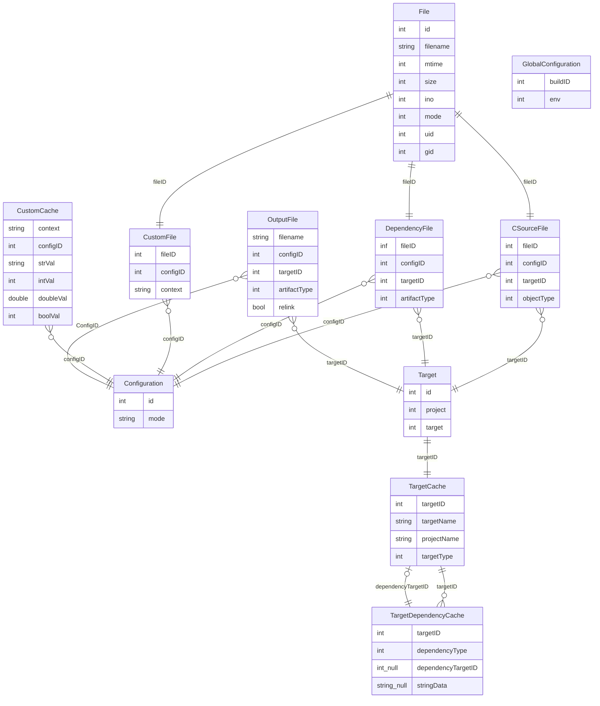
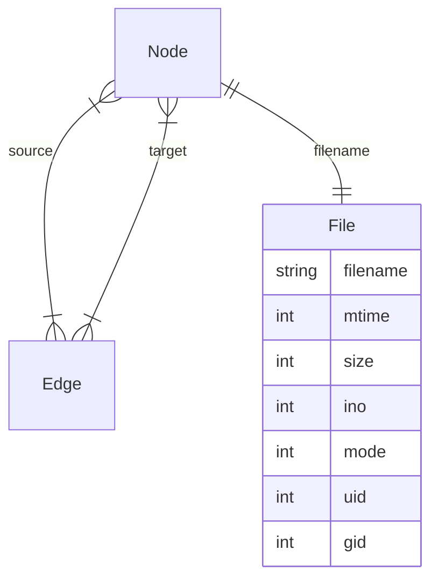
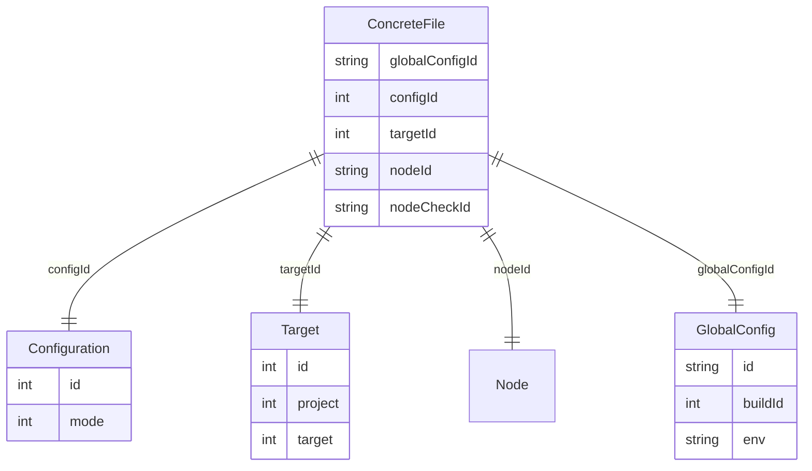
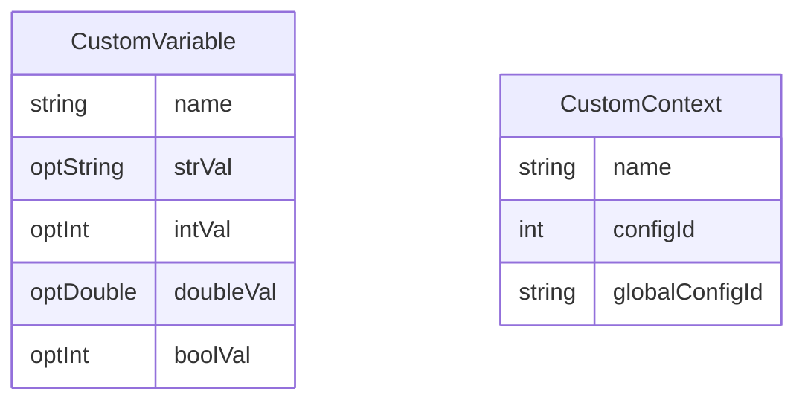

# Old database schema

```mermaid
erDiagram

File {
	int id
	string filename
	int mtime
	int size
	int ino
	int mode
	int uid
	int gid
}

CSourceFile {
	int fileID
	int configID
	int targetID
	int objectType
}

Configuration {
  int id
	string mode
}

Target {
	int id
	int project
	int target
}

GlobalConfiguration {
	%% The Beaver buildId; regenerated on every build
  int buildID
  %% A hash computed from the environment variables
  int env
}

DependencyFile {
	inf fileID
	int configID
	int targetID
	%% The artifact this dependency is linked to
	int artifactType
}

CustomFile {
	int fileID
	int configID
	string context
}

CustomCache {
	string context
	int configID
	string strVal
	int intVal
	double doubleVal
	int boolVal
}

OutputFile {
	string filename
	int configID
	int targetID
	int artifactType
	%% Should this artifact be relinked, regardless of any other conditions
	bool relink
}

TargetCache {
	int targetID
	string targetName
	string projectName
	%% Executable or Library
	int targetType
}

TargetDependencyCache {
	int targetID
	%% library, pkgconfig, system, customFlags
	int dependencyType
	int_null dependencyTargetID
	%% for pkgconfig: the name + preferStatic (int)
	%% for system: the name
	%% for customFlags: format = cflags:[...],linkerFlags:[...]
	string_null stringData
}

File ||--|| CSourceFile: fileID
CSourceFile }o--|| Configuration: configID
CSourceFile }o--|| Target: targetID

File ||--|| DependencyFile: fileID
DependencyFile }o--|| Configuration: configID
DependencyFile }o--|| Target: targetID

%% TODO: link to configuration?
File ||--|| CustomFile: fileID
CustomFile }o--|| Configuration: configID

CustomCache }o--|| Configuration: configID

OutputFile }o--|| Configuration: ConfigID
OutputFile }o--|| Target: targetID

Target ||--|| TargetCache: targetID
TargetCache ||--o{ TargetDependencyCache: targetID
TargetCache |o--|| TargetDependencyCache: dependencyTargetID
```

# New schema (TargetCache)

```mermaid
erDiagram

%% The graph %%

Node {}
Edge {}

Node }|--|{ Edge: source
Node }|--|{ Edge: target

%% Information used while building/updating graph %%

%% Table containing all unique files that have to be compiled. Updated every time the
%% file is checked (when a graph is walked)
File {
	%% Primary Key
	string filename
	int mtime
	int size
	int ino
	int mode
	int uid
	int gid
}

Node ||--|| File: filename

```

# New schema (ConcreteFile)

```mermaid
erDiagram

Configuration {
	int id
	int mode
}

Target {
	int id
	%% ID's as used inside of Beaver
	int project
	int target
}

%% A file that is present in a Node, with information about the target it belongs
%% to, the configuration, etc. to determine where it belongs to in which invocation
%% The node's checkId is used to determine if it should be rebuilt
ConcreteFile {
	string globalConfigId
	int configId
	int targetId
	%% filename
	string nodeId
	%% If this equals the checkId of the node, then this file shouldn't be rebuilt
	string nodeCheckId
}

GlobalConfig {
	string id
	int buildId
	string env
}

ConcreteFile ||--|| Configuration: configId
ConcreteFile ||--|| Target: targetId
ConcreteFile ||--|| Node: nodeId
ConcreteFile ||--|| GlobalConfig: globalConfigId
```

# New schema (Variables)

```mermaid
erDiagram

CustomVariable {
	%% name is unique
	string name
	optString strVal
	optInt intVal
	optDouble doubleVal
	optInt boolVal
}

CustomContext {
	%% name is unique
	string name
	int configId
	string globalConfigId
}
```

