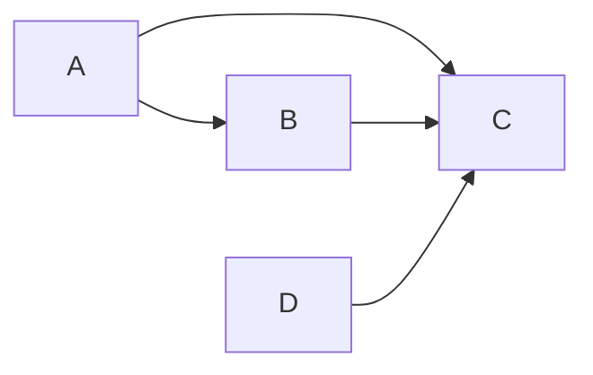

# How It's Built

- A Beaver **context** consists of projects.
- A **project** consists of targets.
- A **target** can be built and produces artifacts

When building a target, a dependency tree is built. The leaves of this tree are built first.

**An example**

In this example, A and D are built first, when A finishes, then B starts.
When D and B are finished, then C starts building.

## When is something rebuilt?

- An **source file** is rebuilt when it has been changed.
- An **artifact** is rebuilt when any of the source files where rebuilt, or if the artifact doesn't exist.
- A **dependant's artifact** is relinked when any of its dependency's artifacts are rebuilt.

These conditions are checked in the `build` method of a target.
